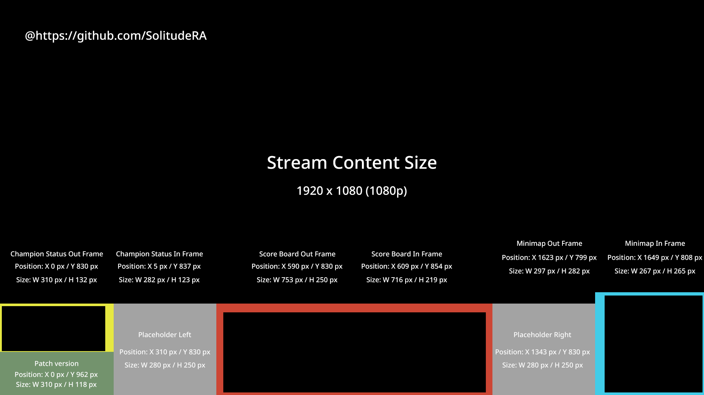

# 英雄联盟电竞赛事直播手册（不含国服）

## In-game观赛UI设计数据

### 观赛UI Layout

### Champion status placeholder

[PNG](../assets/champion-status-placeholder.png)

[PSD](../assets/champion-status-placeholder.psd)

### Scoreboard placeholder

[PNG](../assets/scoreboard-placeholder.png)

[PSD](../assets/scoreboard-placeholder.psd)

### Mini-map placeholder

[PNG](../assets/minimap-placeholder.png)

[PSD](../assets/minimap-placeholder.psd)

## 直播工具链

### OBS

OBS Studio是一款开源的直播工具，可以帮助你快速的开始直播，并且可以帮助你快速的推送直播内容。

[下载地址](https://obsproject.com/)

### League prod toolkit

用于英雄联盟电竞直播的开源OBS浮层工具，提供赛前BP，游戏内事件，赛后面板等功能。

[Github页面](https://github.com/RCVolus/league-prod-toolkit)

### League observer tool

League prod toolkit的本地OB工具，用于与League prod toolkit的LCU端点进行通信，提供游戏内事件监测。

[Github页面](https://github.com/RCVolus/league-observer-tool)

### Creator Suite Replay / League Director

英雄联盟客户端比赛回放的镜头工具，可以用于比赛开始的空镜头拍摄以及后续高光的导演镜头拍摄，上述两个软件都开源可用。Creator Suite Replay由SkinSpotlights开发（推荐使用），League Director由英雄联盟官方开发。

[Creator Suite Replay](https://github.com/SkinSpotlights/CreatorSuite-ReplayAPI/releases)

[League Director](https://github.com/RiotGames/leaguedirector)

### 网页Banpick工具

[PentaQ Web BP Tool](https://data.pentaq.com/bp)

### Photoshop(可选)

Adobe Photoshop是一款用于图像处理的软件，可以帮助你快速的制作直播内容。

[下载地址](https://www.adobe.com/cn/products/photoshop.html)

### VB-Cable(可选)

VB-Cable是一款虚拟音频设备软件，可以帮助你进行直播时的多路音频输入输出及控制。

[下载地址](https://vb-audio.com/Cable/)

### ReplayBook(可选)

ReplayBook是一款用于英雄联盟比赛Replay（.rofl）回放的开源软件，可以用于赛后Highlight制作。

[Github页面](https://github.com/fraxiinus/ReplayBook)

### Riot LOL Creator-Safe Playlist

Riot官方提供的创作者安全音乐播放列表，可以用于直播时的音乐播放。

[Spotify Creator-Safe Playlist](https://open.spotify.com/playlist/5hDYD44imzFZEqTfAoco1N?si=Ik6B1FizS4ewpPlwAxawtQ)

[SoundCloud Creator-Safe Playlist](https://soundcloud.com/leagueoflegends/sets/riot-games-creator-safe)

### League of Legends Data Dragon(可选)

League of Legends Data Dragon是英雄联盟官方提供的资料包，包含英雄资料、物品资料、阵容资料以及相关插图等。

[LOL Data Dragon](https://developer.riotgames.com/docs/lol#data-dragon)

### Stream Deck(可选)

一款适用于直播的可编程快捷键外设，可以用于快速场景切换及比赛ob视角切换。

## OBS相关设置

参考自[Meta Business 帮助中心](https://zh-cn.facebook.com/business/help/1968707740106188?id=648321075955172)

### 推流设置

出于内容安全角度及游戏内OB工具的内容安全要求，推荐以1080p@60fps的格式进行推流。

OBS Studio推流配置流程：

1. 在 OBS 中点击 **Settings（设置）**。
2. 点击 **Output（输出）**。
3. 在 Output Mode（输出模式）下拉菜单中选择 **Advanced（高级）**。
4. 在 Encoder（编码器）下拉菜单中选择 **H264 视频编码器**。
5. 确定[上传速度](http://www.speedtest.net/)。
6. 将上传速度减去 20%，然后在 **Bitrate（比特率）** 中输入所得数字。推荐比特率为 7500 Kbps 至 8500 Kbps（7.5 至 8.5 Mbps）。
7. 确保 **Keyframe Interval（关键帧间隔）** 设置为 2。
8. 点击 **Settings（设置）**。
9. 点击 **Video（视频）**。
10. 设置所需的 **Resolution（分辨率）**：推荐分辨率为 1080p (1920 x 1080)，每秒传输帧数为 60。

### 场景及内容设置

推荐将直播流程标准化，对每个直播步骤（Banpick，比赛中，赛后等）都进行场景设置，以便更好的控制直播内容。

创建场景。

1. 在 OBS 中右键点击 **Scenes（场景）框**。
2. 选择 **Add（添加）**。
3. 为场景命名。
4. 点击 **OK（确定）**。
5. 您可以创建多个场景，并在直播期间自由切换。

### 为每个场景配置内容来源

推荐合理利用**VB-Cable**进行多路音频输出以便隔离不同来源的音频信号（BGM，游戏声音，解说声音，其他直播外声音等）。

推荐使用OBS Studio中自带的**颜色标记**功能来区分不同内容来源，以便更好的控制直播内容以及应对突发事件。

#### Warm up

1. 图像源(比赛海报及参赛队伍logo等)
2. 文本源(比赛名称，参赛队伍名称等)
3. 音频输出源(BGM)
4. 音频输入源(解说)

#### Banpick

1. 浏览器源(League observer tool banpick组件或网页Banpick工具)
2. 图像源(比赛海报及参赛队伍logo等)
3. 文本源(比赛名称，参赛队伍名称等)
4. 音频输出源(游戏声音)
5. 音频输出源(BGM)
6. 音频输入源(解说)

#### In-game

推荐建立多个场景以应对正常、团战、高光回放等不同比赛场景。

1. 浏览器源(League observer tool In-game组件)
2. 图像源(观赛浮层界面)
3. 音频输出源(游戏声音)
4. 音频输入源(解说)

#### After-game

1. 浏览器源(League observer tool 赛后组件)
2. 文本源(比赛名称，参赛队伍名称等)
3. 图像源(比赛海报及参赛队伍logo等)
4. 音频输出源(BGM)
5. 音频输入源(解说)

#### Interlude

1. 文本源(比赛名称，参赛队伍名称及比分等)
2. 浏览器源(场间倒计时工具)
3. 图像源(比赛海报及参赛队伍logo等)
4. 音频输出源(BGM)